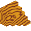

# Normal Map Rendering Tutorial

This repository provides tutorial on how to render icons using normal maps in Dream Maker (DM). It aims to help both beginner and experienced coders enhance their skills and understanding of advanced icon manipulation in DM. 

The tutorial covers several critical concepts such as setting up icons, defining and manipulating icon colors, setting the direction of the light, illuminating the scene, and the final rendering process. Each section is elaborated with appropriate code snippets, complemented by visual aids to ensure a clear understanding of the concepts. 

- [Normal Map Rendering Tutorial](#normal-map-rendering-tutorial)
- [Prerequisites](#prerequisites)
  - [Icon: `icon()`](#icon-icon)
  - [Icon Operations: `*`, `/`, `+`](#icon-operations---)
  - [Color Matrix: `icon.MapColors()`](#color-matrix-iconmapcolors)
- [Process](#process)
- [States](#states)
  - [Diffuse](#diffuse)
  - [Normal](#normal)
    - [Positive](#positive)
    - [Negative](#negative)
  - [Lighting](#lighting)
    - [Positive](#positive-1)
    - [Negative](#negative-1)
  - [Illumination](#illumination)
  - [Render](#render)
    - [Base](#base)
    - [Reduced](#reduced)

# Prerequisites
In order to effectively execute graphic rendering processes in BYOND Dream Maker, you'll need to understand and be able to implement the following functions and operations:

## Icon: `icon()`
This function is instrumental in facilitating the management of graphical data within the BYOND environment. The `icon()` function works by accessing, reading, and duplicating icon files. It plays a crucial role in the manipulation and transformation of image-based data, thereby enabling you to use this copied icon for various processing tasks related to image information.

## Icon Operations: `*`, `/`, `+`
Icon operations (`*`, `/`, `+`) are basic arithmetic operators with a particular purpose in BYOND Dream Maker's graphics management. They perform computations on the numerical attributes of icon data, thereby allowing for the manipulation and modification of icon characteristics. These operations work by altering the properties of icons, such as their size, orientation, or blending parameters, providing more control and flexibility in shaping the visual output.

## Color Matrix: `icon.MapColors()`
The Color Matrix, represented by the `icon.MapColors()` function, plays a pivotal role in the transformation of color data within the BYOND framework. It is specifically used to convert encoded color information into a more practical, manipulable form. This function takes an encoded color value as input, and remaps the color components using a defined matrix, thereby enabling the customization of how colors are displayed and processed within your graphical renderings

# Process

1. Grab image information
   1. Diffuse and Normal states are grabbed from the file
2. Split the normal into positive and negative spaces
   1. Positive space is used for positive scalars
   2. Negative space is used for negative scalars
3. Generate a light direction icon
   1. Light direction is generated from a 3D vector
   2. Vector is converted into a color that represents the encoded vector
4. Split the light direction into positive and negative spaces
   1. Positive space is used for positive scalars
   2. Negative space is used for negative scalars
5. Combine normal and light information and add them together into illumination
   1. Positive and negative scalars are multiplied for normals and lights
   2. Positive and negative scalars are converted into grayscale
   3. Positive and negative scalars are summarized into illumination
6. Render the icon by combining diffuse state with illumination
   1. Diffuse and illumination is multiplied together
   2. The result is then multiplied by the light color for final result
7. (Extra) Reduce the amount of colors represented in the icon
   1. Render is divided by the defined step size between colors
   2. Render is multiplied by the defined step size between colors

# States
States are specific configurations or conditions in which an image can exist. They are integral in the manipulation and processing of graphics. In this context, states primarily refer to the various stages of image information during the rendering process. These include the original image information such as diffuse and normal states, the split positive and negative spaces of the normal and light directions, the combined illumination state, and the final rendered state of the icon. Additionally, a state can also refer to the condition of the image after the color representation has been reduced. Each state plays a pivotal role in transforming the original image information into the final rendered icon.

## Diffuse
A diffuse map in rendering is a texture that defines the base color and surface properties of an object, determining how it interacts with light and appears without any additional effects like reflections or specular highlights.

## Normal
A normal, in the context of computer graphics, is a vector that is encoded into color space and signifies the direction that a surface is facing at a given point. Each of the RGB color channels in this color representation corresponds to one of the three dimensions of the vector. The normal is crucial in creating realistic lighting effects, as it informs how light should reflect off the surface. By encoding this vector information as a color, we can give flat, 2D images the appearance of having depth and texture. This technique, known as normal mapping, enables the simulation of complex lighting scenarios and gives flat objects a more three-dimensional appearance.

### Positive
The positive space refers to the set of surface normals that are oriented towards the positive direction of the axes. In the color representation, this typically translates to colors from middle gray to white (from the RGB value `(128,128,128)` to `(255,255,255)`). It symbolizes the part of the object that faces towards the positive direction of light, and thus, receives more light.

### Negative
Conversely, the negative space of normals refers to those normals that are oriented towards the negative direction of the axes. In color representation, this translates to colors from middle gray to black (from the RGB value `(128,128,128)` to `(0,0,0)`). This symbolizes the part of the object that faces away from the light source, thereby receiving less light, or none at all.

## Lighting
Light, within the realm of computer graphics, pertains to the direction of a light source in a three-dimensional space. This light direction, integral to the rendering process, is encoded into the RGB color space, transforming a spatial concept into a format suitable for image-based operations. Each color channel - red, green, and blue - corresponds to one dimension of the directional vector, effectively encapsulating the light source's orientation in a 3D environment.

This encoded light direction becomes the basis for calculating light interactions with the surfaces of objects, particularly when determining the light intensity that impacts a single pixel. It allows us to take into account factors such as the angle and orientation of the light relative to the surface. By utilizing this light information, we can accurately compute lighting effects, including highlights, shadows, and shading, resulting in a more realistic and visually appealing render.

### Positive
The positive space corresponds to the portion of the light direction vector pointing towards the positive direction of the axes. It is represented in color space by colors ranging from middle gray to white (RGB values from `(128,128,128)` to `(255,255,255)`). This space essentially symbolizes the sections of an object that are directly facing the light source and are therefore more illuminated.

 ×  = 

### Negative
Conversely, the negative space signifies the portion of the light direction vector pointing towards the negative direction of the axes. This is visualized in color space as colors from middle gray to black (RGB values from `(128,128,128)` to `(0,0,0)`). This space represents the sections of an object that are angled away from the light source, hence, receiving less light or being in shadow.

 ×  = 

## Illumination
Illumination is a crucial concept in the realm of computer graphics, aiming to emulate the interplay of light with the surfaces depicted by the normal maps. It incorporates both the direction and intensity of light, along with the surface properties encoded in the normals, to generate a realistic depiction of how light falls upon and interacts with an object. This computational illumination is instrumental in generating visually compelling renderings, as it generates the dynamic interplay of light and shadows, producing the illusion of depth and texture on a flat image. By accurately representing highlights, shadows, and gradations of light, illumination helps bring two-dimensional images to life, offering a more immersive, three-dimensional visual experience.

 +  = 

## Render
Rendering is the computational process of generating a visual image from raw data. In the context of your process, rendering involves the combination of diffuse state (the inherent color of an object) and illumination (the simulation of light interaction on the object's surface), to create a visually rich and realistic portrayal of the object. This final render effectively captures the object's appearance under specific lighting conditions. The "reduced" render is a further optimized version, where the number of colors used has been minimized to either achieve specific stylistic effects or to reduce memory usage and computational load.

### Base
The base render is the final outcome of combining the diffuse state of the image, which is its inherent color in absence of light, and the calculated illumination, simulating how light interacts with the object's surface. The result is a realistic visual portrayal of the object with accurately rendered highlights, shadows, and light gradations. This render is crucial in transforming the raw image data into a visually rich, detailed image that effectively mimics the behavior of light on the object's surface.

 ×  ×  = 

### Reduced
The reduced render is an optimized version of the base render, where the number of colors used in the image has been deliberately minimized. While it still maintains the primary visual information, this simplification can be useful for creating certain stylistic effects, or to reduce memory usage and computational requirements. Despite the reduction in color detail, the essential characteristics of the image such as shape, shading, and lighting are preserved, allowing for effective representation with lower computational overhead.

 → 